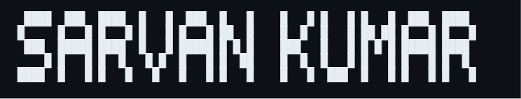

<table width="100%">
  <tr>
    <td width="65%" valign="middle">
      
      

        Third-year <strong>B.Tech Computer Science</strong> student at
        <strong>Amrita Vishwa Vidyapeetham, Chennai Campus</strong>.
        I like building useful products, clean interfaces, automation, and small tools
        that make work feel lighter.
      

      

        
        
        
      

    </td>
    <td width="35%" valign="middle" align="right">
      
    </td>
  </tr>
</table>
<table width="100%" border="0" cellspacing="0" cellpadding="0">
  <tr>
    <td width="50%" valign="top">
      

<b>Coding Stats</b>

  

</td>
    <td width="50%" valign="top">

<b>Development Stats</b>

</td>
  </tr>
  
</table>

  

